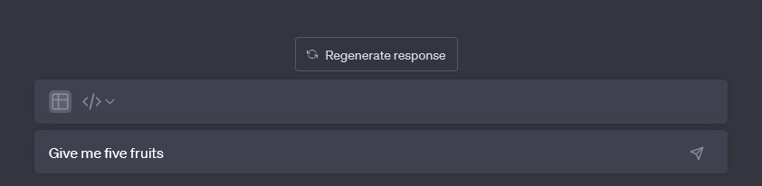
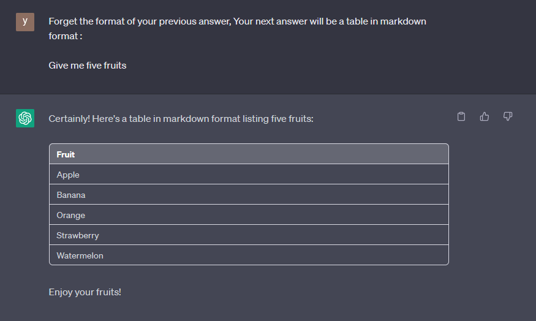
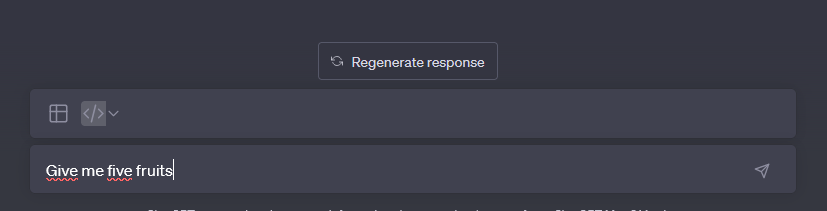
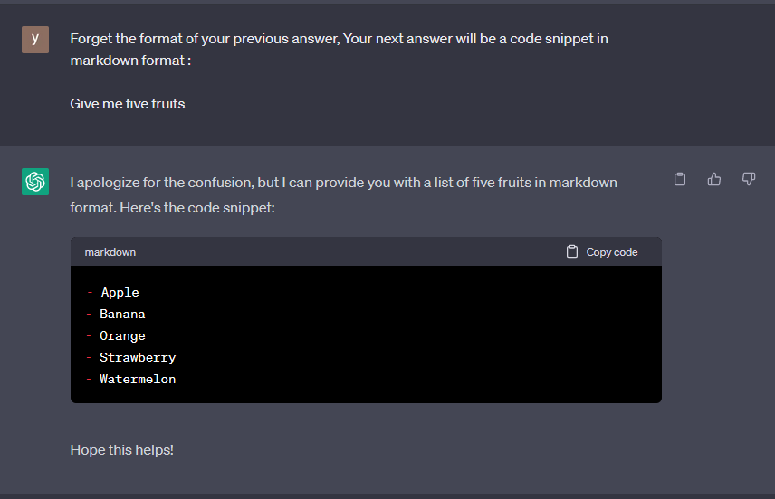
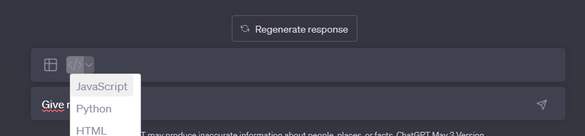
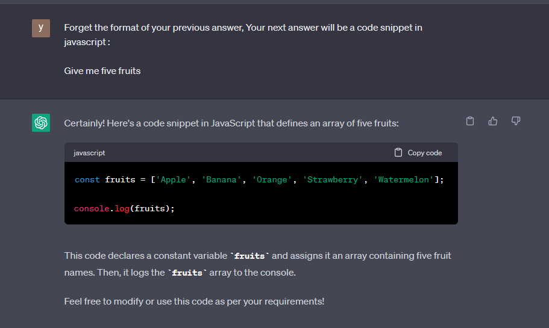
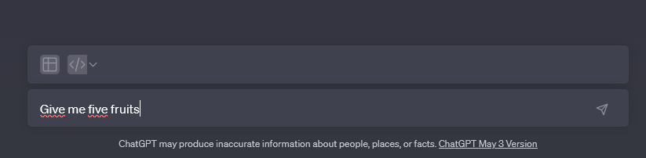
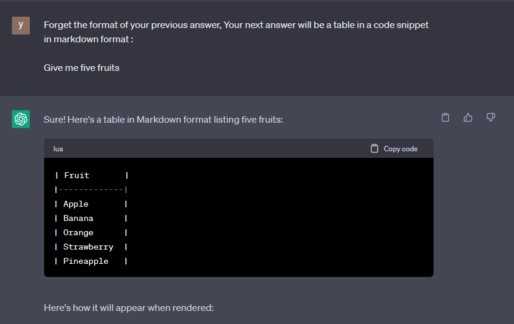
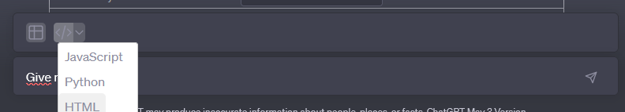
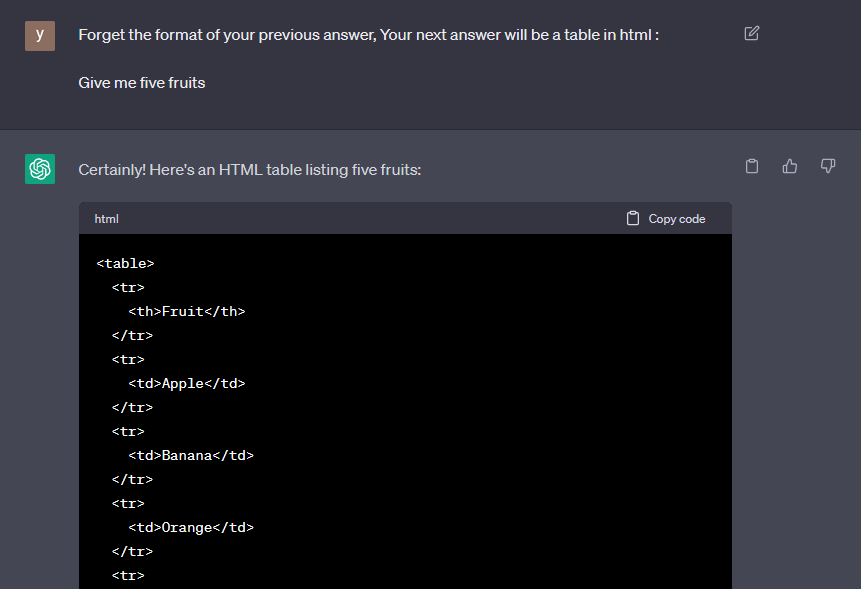

# ChatGPT-Formatter

FireFox extension: Choose a format for GPT chat responses, and your prompt will adapt accordingly.

## Markdown table 

## Markdown code snippet

## Javascript code snippet

## Markdown table code snippet

## HTML table code snippet

## Features

- [x] Table
- [x] Code
- [x] List
- [x] Silent mode 
- [x] Reset (simple text)
- [x] Language
- [x] Svg
- [x] View/Hide prompt

