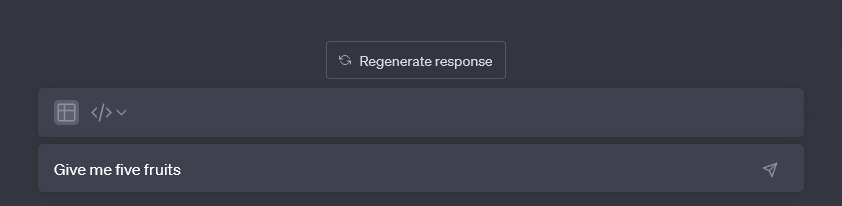
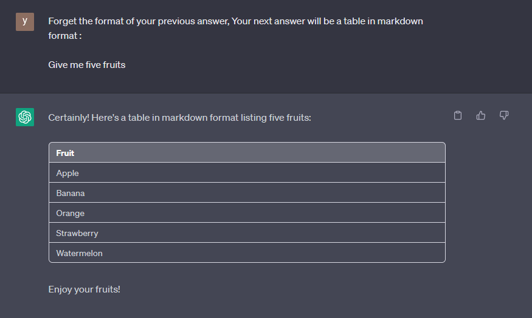
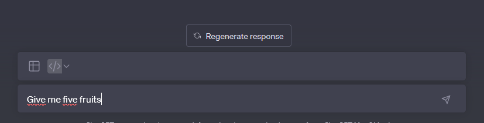
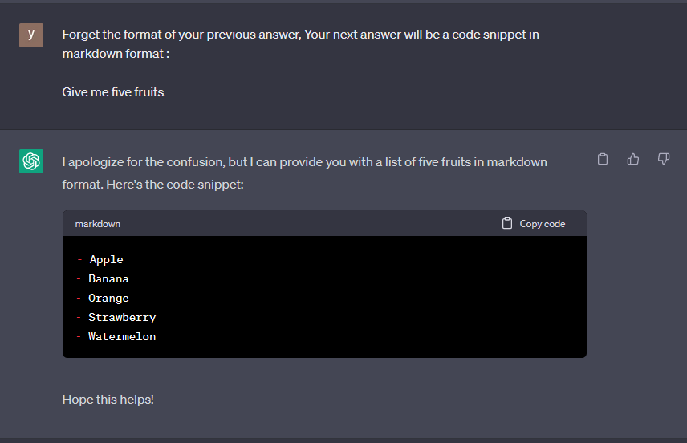
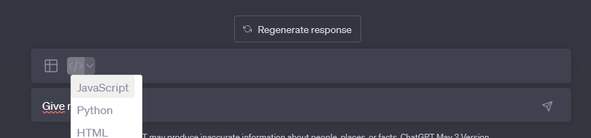
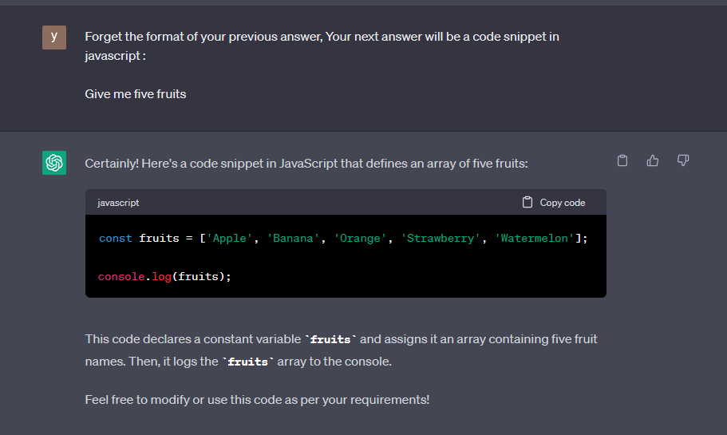
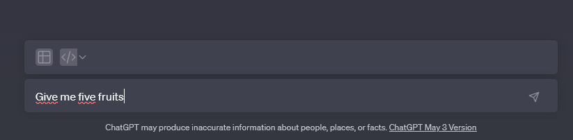
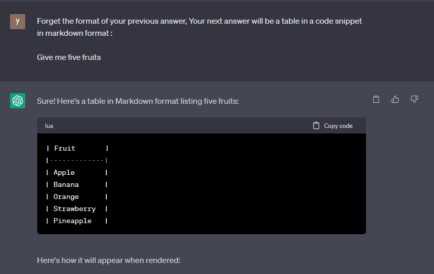
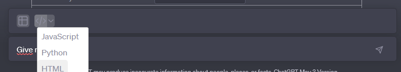
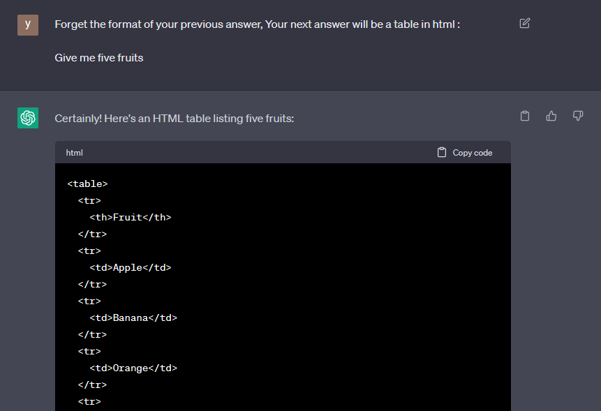

# ChatGPT-Formatter

## Description

FireFox extension: Choose a format for GPT chat responses, and your prompt will adapt accordingly.

## Prerequisites

Ensure you have the following installed on your system:

- Node.js and npm: [Download](https://nodejs.org)
- Firefox: [Download](https://www.mozilla.org/firefox)

## Installation

1. Clone the repository:
```bash
git clone https://github.com/Yorik56/ChatGPT-Formatter ChatGPT-Formatter
```
2. Navigate into the project directory:
```bash
cd ChatGPT-Formatter
```
3. Install the dependencies:
```bash
npm install
```

## Building

To build the extension, run:

```bash
npm run build
```

This will generate a `src` folder with the extension files.

## Testing the Extension

Load the extension into Firefox for testing by following these steps:

1. Open Firefox and enter `about:debugging` in the address bar.
2. Click on "Load Temporary Add-on” and select the `manifest.json` at the root of the project.

## Contact

If you have any questions or issues, please open an issue in this repository.

## Usage

FireFox extension: Choose a format for GPT chat responses, and your prompt will adapt accordingly.

## Markdown table 


## Markdown code snippet


## Javascript code snippet


## Markdown table code snippet


## HTML table code snippet


## Features

- [x] Table
- [x] Code
- [x] List
- [x] Silent mode 
- [x] Reset (simple text)
- [x] Language
- [x] Svg
- [x] View/Hide prompt


